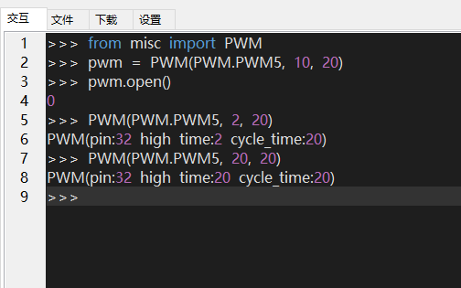

# QuecPython  PWM开发

文档主要基于EC600S介绍如何使用QuecPython_PWM，PWM通常用于连接驱动LED、蜂鸣器、数字模拟DA转换等等。通过本文你将了解到PWM的所有设置参数及使用方法。

###  硬件描述

目前开放共5个PWM，EVB引出2个PWM口连接位置如下表所示：


PWM0 – 引脚号52 
PWM1 – 引脚号53 
PWM2 – 引脚号57
PWM3 – 引脚号56 
PWM4 – 引脚号70 
PWM5 – 引脚号69

###  软件设计

#### 创建PWM对象

pwm= PWM(PWM.PWMn, highTime, cycleTime)

函数原型：PWM(PWM.PWMn, highTime, cycleTime)，返回一个pwm对象，用于设置PWM的输出周期、占空比。

| 参数      | 参数类型 | 参数说明                                                                                        |
|-----------|----------|-------------------------------------------------------------------------------------------------|
| PWMn      | int      | PWM0 – 引脚号52 PWM1 – 引脚号53 PWM2 – 引脚号57 PWM3 – 引脚号56 PWM4 – 引脚号70 PWM5 – 引脚号69 |
| highTime  | int      | 高电平时间，单位ms                                                                              |
| cycleTime | int      | pwm一个周期时间，单位ms                                                                         |

#### 开启PWM输出

state= pwm.open()

函数原型：open()，返回pwm 设置状态。

| 参数  | 类型 | 说明          |
|-------|------|---------------|
| state | int  | 0成功，-1失败 |

#### 关闭PWM输出

state= pwm.close()

函数原型：close()，返回pwm 设置状态。

| 参数  | 类型 | 说明          |
|-------|------|---------------|
| state | int  | 0成功，-1失败 |

### 交互操作

使用QPYcom工具和模组进行交互，示例如下：



注意：

1.  from misc import PWM即为让PWM模块在当前空间可见。

2.  只有from misc import PWM模块，才能使用PWM内的函数和变量。

### 下载验证

下载.py文件到模组运行，代码如下：

```
from misc import PWM 
import utime  
pwm = PWM(PWM.PWM5, 10, 20) 
pwm.open()  
highTime = 10 
dir = 1  
while 1:  
	if dir:  
		highTime += 2  
		if highTime >= 20:  
			dir = 0  
	else:  
		highTime -= 2  
		if highTime <= 2:  
			dir = 1  
	PWM(PWM.PWM5, highTime, 20)  
	utime.sleep_ms(100)
```

### 名词解释

PWM：脉冲宽度调制

高电平：通常高于用0.8V认为是高电平

低电平：通常低于用0.6V认为是低电平

周期：低电平和高电平时间的总和

占空比：高电平占整个周期的比例

### 配套代码

[下载代码](code/PWM.py)